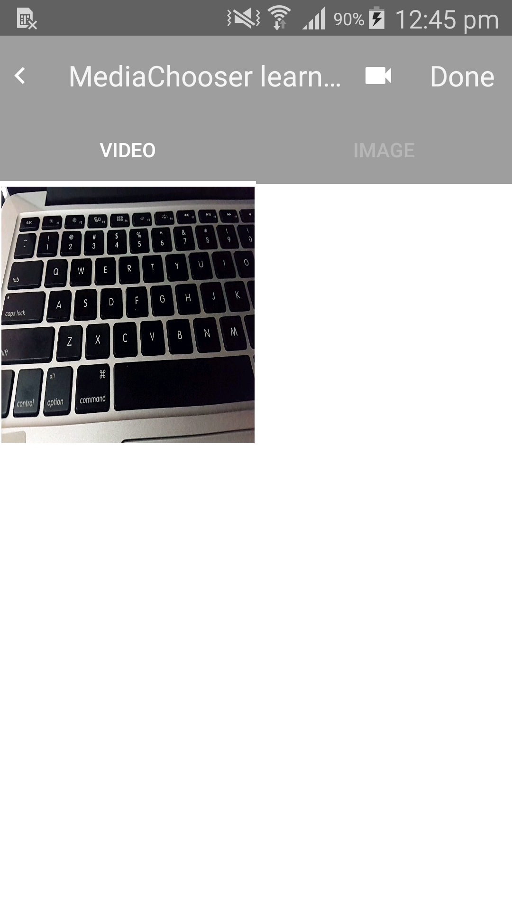
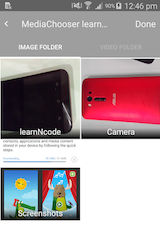
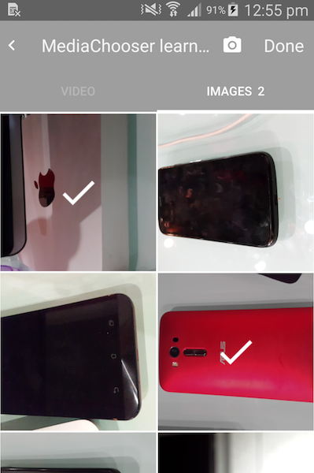

Media Chooser
===================================

Library to browse & select videos and images from disk.


Screenshots
-----------------------------------



<br>



<br>




**Caution!**
------------------------------
Eclipse library project structure has been dropped. If you wish to use this library in your eclipse IDE, please checkout [ MediaChooser-Eclipse](https://github.com/learnNcode/MediaChooser/tree/master/MediaChooser-Eclipse). No further development will be done into [ MediaChooser-Eclipse](https://github.com/learnNcode/MediaChooser/tree/master/MediaChooser-Eclipse).

Setup
-----------------------------------
Add following permission to your applications manifest file.
```xml
 <uses-permission android:name="android.permission.WRITE_EXTERNAL_STORAGE" />
```

Add following code to the application node of your application's manifest file
```xml
<activity
    android:name="com.learnncode.mediachooser.activity.HomeScreenMediaChooser"
    android:screenOrientation="portrait" >
</activity>
```

Caution!
_________________
Eclipse library project structure has been dropped. If you wish to use this library in your eclipse IDE, please checkout MediaChooser-Eclipse. No further development will be done.

ChangeLog
-----------------------------------
<b>Version 2.0 </b>

__1]__ Gradle Build

__2]__ Updated UI

__3]__ Bug Fixes

__4]__ Added new developer friendly methods :)


<b>Version 1.0.6 </b>

   __1]__ Updated UI.
   
   __2]__ Bug fixes.

<b>Version 1.0.5 </b>

   __1]__ Updated picasso jar.
   
   __2]__ Preview file on item longpress.
   
   __3]__ Removed deprecated code.

<b>Version 1.0.4 </b>

   __1]__ Fixed tab content issue.

<b>Version 1.0.3 </b>

   __1]__ Fixed video icon visibility when video tab selected.

<b>Version 1.0.2 </b>

  __1]__ Fixed blank image tab or video tab issue.

<b>Version 1.0.1</b>

  __1]__ Fixed nexus 10 crash.

  __2]__ Added helper methods for ease.


What does this library do ?
-----------------------------------
Useful library for selecting images and videos from sd-card. The library can be used to display images & videos in  file view or folder view.
File view shows all files whereas Folder view shows files categorized.
All items are sorted according to date-time with latest item showing first.


Usage
-----------------------------------

To display images and videos according to:
    
    
__1]__ Folders 
```java
HomeScreenMediaChooser.startMediaChooser(MainActivity.this, true);
```
               
__2]__ Files  
```java
HomeScreenMediaChooser.startMediaChooser(MainActivity.this, false);
```        
        
        
To get list of selected images and videos :
-----------------------------------------------------
    
__1]__ For images you have to register a broadcast with 

`MediaChooser.IMAGE_SELECTED_ACTION_FROM_MEDIA_CHOOSER`action.
    
Example:
```java
IntentFilter imageIntentFilter = new IntentFilter(MediaChooser.IMAGE_SELECTED_ACTION_FROM_MEDIA_CHOOSER);
registerReceiver(imageBroadcastReceiver, imageIntentFilter);
```
        
        
__2]__ For videos you have to register a broadcast with 
    `MediaChooser.VIDEO_SELECTED_ACTION_FROM_MEDIA_CHOOSER` action.
    
Example:
```java
IntentFilter videoIntentFilter = new IntentFilter(MediaChooser.VIDEO_SELECTED_ACTION_FROM_MEDIA_CHOOSER);
registerReceiver(videoBroadcastReceiver, videoIntentFilter);
```        

Helper methods
-----------------------------------
__1]__ showCameraVideoView : To hide/show camera button.
        example: 
```java 
MediaChooser.showCameraVideoView(false); // This will hide the view. By default its visible.
``` 
 
__2]__ setImageSize and setVideoSize : To set file size limit in mb for image/video selection.
        example: 
```java 
MediaChooser.setVideoSize(10); // Default set to 20mb.
MediaChooser.setImageSize(10); // Default set to 20mb.
```
 
__3]__ setSelectionLimit : To set number of items that can be selected.
        example: 
```java         
MediaChooser.setSelectionLimit(10);  //default set to 100.
```
 
__4]__ setSelectedMediaCount / getSelectedMediaCount : To set/retrieve total selected file count.
      example: 
```java 
int totalCount = MediaChooser.getSelectedMediaCount();
```
 
__5]__ showOnlyImageTab :- To show image tab only.
        example:  
```java 
MediaChooser.showOnlyImageTab();
```
        
__6]__ showOnlyVideoTab :- To show video tab only.
        example: 
```java 
MediaChooser.showOnlyVideoTab();
```
        
__7]__ showImageVideoTab : To display both image and video tab.
        example: 
```java 
MediaChooser.showImageVideoTab(); //By default both tabs are visible.
```

Check the attached demo sample app.
    
Acknowledgement
-----------------------------------
[androidquery jar](https://github.com/androidquery/androidquery)
    
License
-----------------------------------

    Copyright 2015 learnNcode (learnncode@gmail.com)

    Licensed under the Apache License, Version 2.0 (the "License");
    you may not use this file except in compliance with the License.
    You may obtain a copy of the License at

     http://www.apache.org/licenses/LICENSE-2.0

    Unless required by applicable law or agreed to in writing, software
    distributed under the License is distributed on an "AS IS" BASIS,
    WITHOUT WARRANTIES OR CONDITIONS OF ANY KIND, either express or implied.
    See the License for the specific language governing permissions and
    limitations under the License.

Thank You
-----------------------------------

  If you like our work say a Hi :)
  
  <br>
  Happy Coding Happy Learning.
